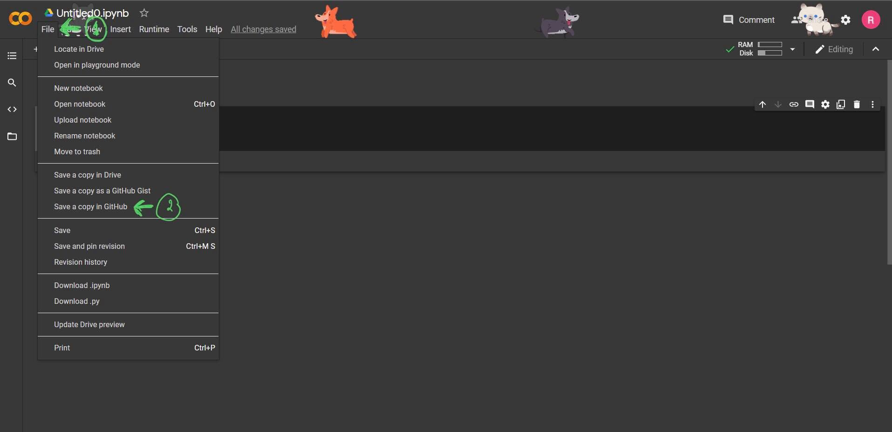
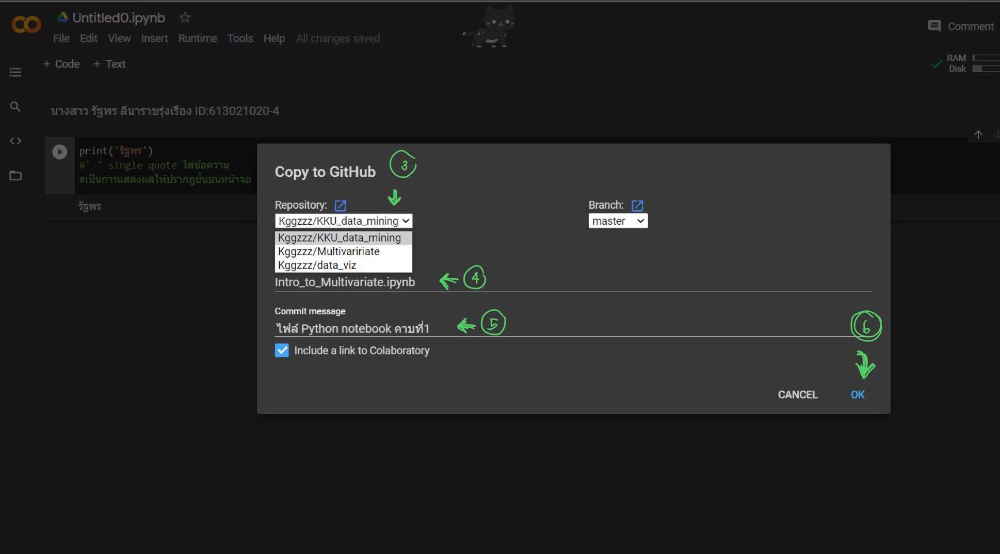
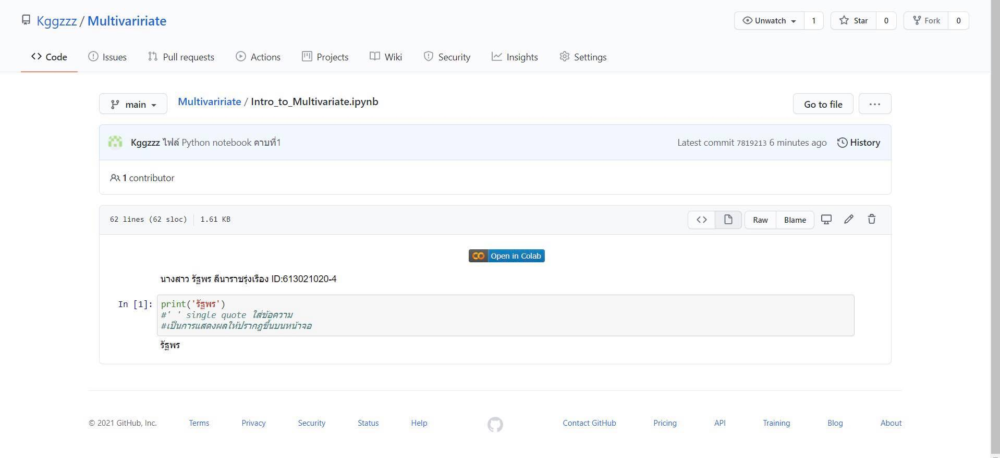

# Multivaririate

### รัฐพร ID: 613021020-4

.md => Markdown

อธิบายการใช้งาน Github และ Google Colab ว่าหน้าที่ของแต่ละอันคืออะไร และอธิบายวิธีเซฟไฟล์จาก Google Colab ลงใน Github

1. Github เป็น Version control ที่จัดเก็บความเปลี่ยนแปลงของไฟล์ในโปรเจคของเราหรือของทีมเรา โดยคนที่เข้าGithubของเราจะสามารถเปลี่ยนแปลง, เพิ่ม, ลบอะไรในโปรเจคไปพร้อมๆกับเราได้ เป็นตัวกลางในการส่งโปรเจคืั้เรากำลังทำให้คนอื่นสามารถเข้ามาดูได้ 

2. Google Colab เป็นที่ๆสามารถเขียนโค้ด Python ได้ โดยในตัว Google Colab นั้นจะมีทั้ง Code cell และ Text cell เพื่อให้ตัวผู้ทำโปรเจคนั้นๆมีทั้งการเขียนอธิบายวิธีการต่างๆหรือหน้าที่ของโค้ดนั้นๆได้ และตัว Google ฉนสฟิ นั้นยังสามารถเซฟลงใน Drive หรือที่ต่างๆได้อีกด้วย ทำให้ง่ายต่อการใช้งาน 

3.วิธีการเซฟไฟล์จาก Google Colab ลงใน Github

เมื่อพิมงานใน Google Colab เสร็จแล้วให้กดที่คำว่า _File_ จากนั้นเลือกที่คำว่า _Save a coppy in GitHub_

เมื่อกดเสร็จแล้วให้เลือกโปรเจคที่ต้องการจะ _Save_ ในครั้งนี้เราจะเลือกเป็น _Multivariate_ จากนั้นกดตรงช่อง _Commit message_ แล้วตั้งชื่อที่ต้องการจะcommit สุดท้ายจึงกด _OK_ 

เมื่อเซฟไฟล์เข้า Github ได้สำเร็จจะขึ้นหน้าบราวเซอร์นี้ขึ้นมา 

4.วิธีการแทรกรูป Markdown 

